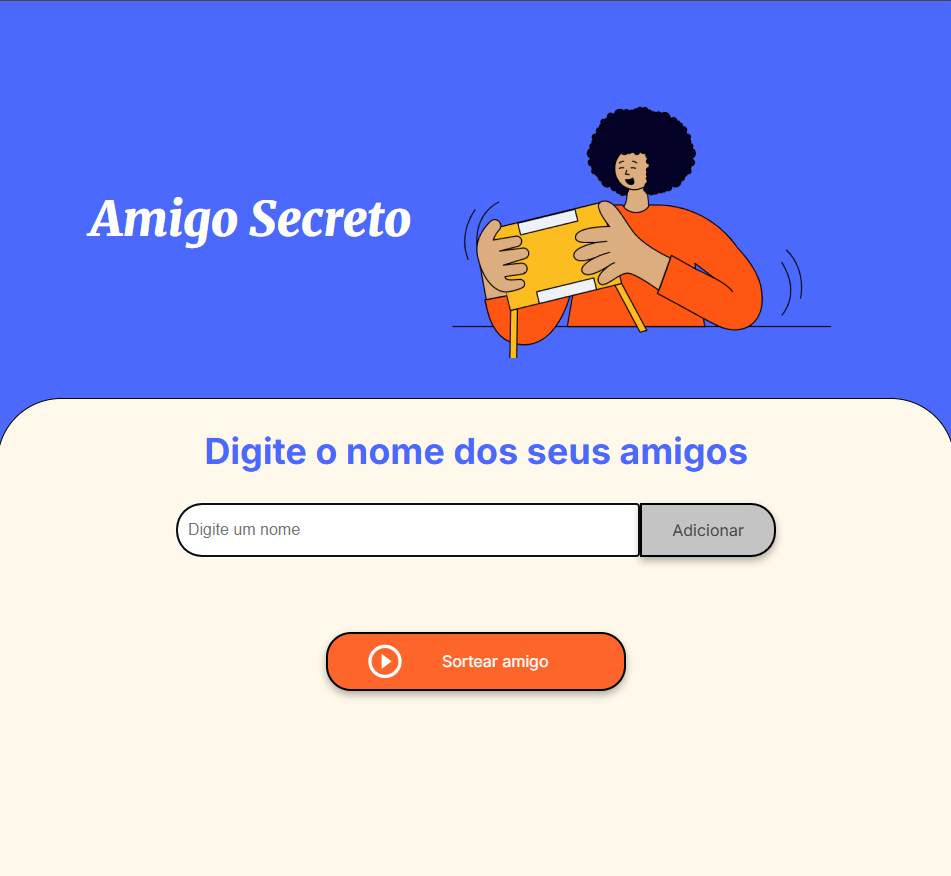
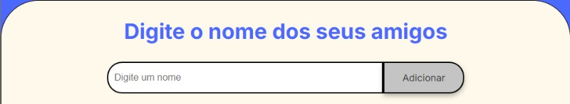
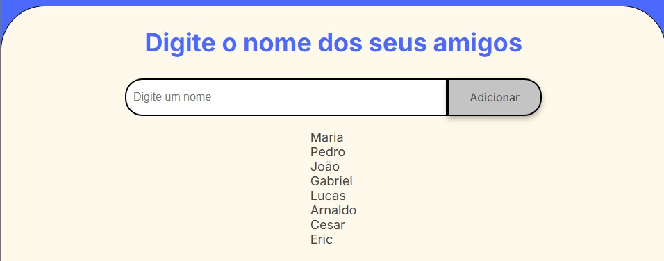
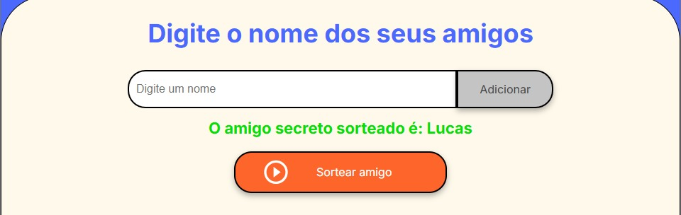

<div align="center">
  
</div>

# 🚀 Amigo Secreto 🔒🔑

## 📌 Sobre

- Projeto desenvolvido como parte dos estudos da bolsa da **[ONE (Oracle Next Education)](https://www.oracle.com/br/education/oracle-next-education/)** na plataforma **[Alura](https://www.alura.com.br/?srsltid=AfmBOorGmTLvLY55LAmY5ua6TUqAXqoAIRQnveqyBbcYgFRDJlsxp86f)**

<hr>

- A ideia do projeto é que o usuário crie uma lista de amigos e possa sortear um ou mais amigos dessa lista.

## 💻 Tecnologias e Ferramentas

<div align="left">

  
  
  
  
</div>
<br>

## ☝️ Instruções de uso 📖

- Tela Principal
  

- Digite o nome que deseja adicionar ao sorteio
- Após digitar o nome, clique no botão Adicionar
  

- Após clicar em adicionar, todos os nomes que você colocou irá parecer em formato de lista.
  

- Agora é só clicar no botão Sortear amigo, o sistema de forma randomica vai escolher 1 e exibir qual foi o sorteado.
  

##

<br>

## 📍Obter o projeto localmente ⬇️

Para utilizar o projeto em sua máquina você precisa realizar uma cópia do mesmo, utilizando o comando **git clone**.

```bash
git clone https://github.com/He-Dark/Amigo-Secreto.git
```

## Licença 📃

🚨 Este projeto está sob a licença **[MIT](./LICENSE)** license 🚨
